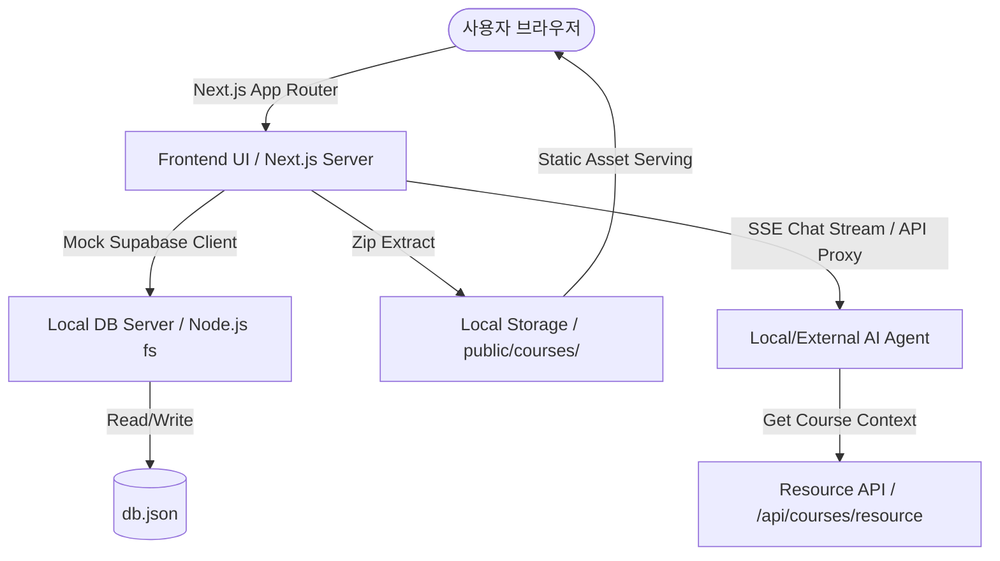

# Open Tutorials Application Architecture

Open Tutorials는 로컬 환경에서 AI 에이전트와 함께 학습하고, 다양한 강좌(Course) 콘텐츠를 업로드 및 관리할 수 있는 데스크탑 친화형 로컬 학습 플랫폼입니다.

기존의 클라우드(Supabase, Vercel) 기반 SaaS 모델에서 벗어나, **완전한 온디바이스 로컬 애플리케이션**으로 동작하도록 아키텍처가 재설계되었습니다.

---

## 🏗️ 시스템 아키텍처 개요

### 1. Frontend 레이어
- **기술 스택**: Next.js (App Router) + TypeScript + Tailwind CSS + Shadcn UI
- **특징**: SPA처럼 즉각적이고 반응성이 높은 UI를 제공하며, 사용자 대시보드, 강좌 목록, 학습 플레이어(Learn), 에이전트 관리(My Agents) 기능을 통합 제공합니다.

### 2. Backend & Mock Database 레이어 (Local DB)
- **로컬 DB (`db.json`)**: 복잡한 PostgreSQL 클라우드 서버 대신, 루트 경로의 `db.json` 파일을 단일 데이터 데이터베이스 파일로 사용합니다.
- **Mock Supabase Client (`lib/supabase/mock-client.ts`)**: 기존 코드베이스의 Supabase 쿼리 문법(`.from().select().eq().single()`)을 그대로 유지하면서, 내부적으로 Local DB API 엔드포인트(`/api/local-db`)를 통해 서버사이드 파일 시스템(`db.json`)에 접근하도록 에뮬레이션합니다.
- **Local DB Server (`lib/db/local-db-server.ts`)**: Node.js `fs` 모듈을 사용하여 `db.json` 파일을 직접 읽고 쓰며, 기본적인 CRUD 쿼리 필터링을 수행합니다.

### 3. 로컬 파일 스토리지 (Storage Mocking)
- **정적 서빙**: 클라우드 오브젝트 스토리지(Supabase Storage) 대신 로컬 파일 시스템을 사용합니다.
- **경로**: 강좌 업로드 시 제공된 zip 파일의 압축을 풀어 `public/courses/[course-slug]/` 하위에 저장합니다.
- **연동**: 웹 애플리케이션에서는 Next.js 정적 파일 서빙 기능을 이용해 `/courses/[course-slug]/[asset-name]` 주소로 에셋(이미지, 추가 리소스 등)에 즉각 접근합니다.

### 4. AI 튜터 및 에이전트 연동 (AI Worker API)
- **외부/로컬 에이전트 등록**: Ollama, LM Studio 등 로컬 LLM 서버나 OpenAI, DeepSeek 등의 외부 API 에이전트를 등록 및 설정할 수 있습니다.
- **AI 튜터링**: 학습 플레이어 화면에서 활성화된 AI 에이전트(AI 튜터)가 학습을 돕습니다.
- **컨텍스트 주입**:
  - 질문 전송 시 현재 학습 중인 카드의 내용이 컨텍스트로 함께 전달됩니다.
  - 강좌 리소스 다운로드 API(`/api/courses/[slug]/resource`)를 통해 에이전트가 학습 자료 전체를 Markdown 포맷으로 다운로드하여 학습 흐름을 완벽히 이해할 수 있도록 지원합니다.

### 5. 권한 및 세션 간소화
- **데스크탑 전용**: 로컬 전용 앱이므로 복잡한 사용자 가입/로그인 과정을 생략합니다.
- **자동 로그인**: 고정된 로컬 사용자 ID (`local-user-id`) 세션을 기반으로 구동되며, 앱 진입 시 대시보드로 자동 리다이렉트 처리됩니다.
- **어드민 권한 우회**: `requireAdmin()` 검증 로직이 항상 성공(`true`)을 반환하므로, 일반 사용자 모드에서도 강좌 등록, 매니페스트 관리 등 모든 어드민용 편의 기능을 자유롭게 사용할 수 있습니다.
